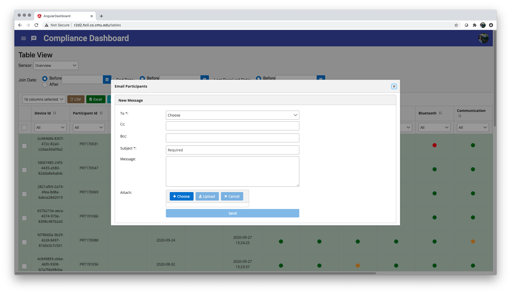
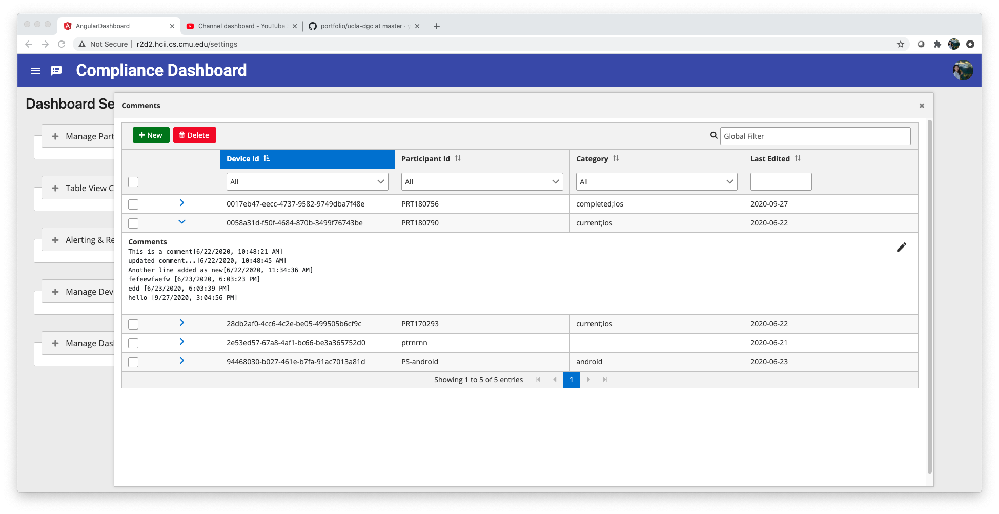

# AWARE Compliance Dashboard (Full-stack Angular Web Application)

*Compliance Dashboard - Welcome&Login*

*Compliance Dashboard - Login Session Expired*

*Compliance Dashboard - Side Navigation Panel*

*Grafana Embedded Panels - Stats*

*Grafana Embedded Panels - Overview*

*Grafana Embedded Panels - Participants View*

*Compliance Dashboard - Table View (General)*

*Compliance Dashboard - Table View (Specific Sensor)*

*Compliance Dashboard - Email Functionality*

*Compliance Dashboard - Comments Feature*

*Compliance Dashboard - Add Comments*

*Compliance Dashboard - Edit Comments*

*Compliance Dashboard - Delete Comments*

*Compliance Dashboard - Comments Expanded*

*Compliance Dashboard - Settings*

*Compliance Dashboard - Alert & Report Functionality*

*Compliance Dashboard - Manage Participant's Info*

*Compliance Dashboard - Manage Device Category*

*Compliance Dashboard - Table View Configuration*

